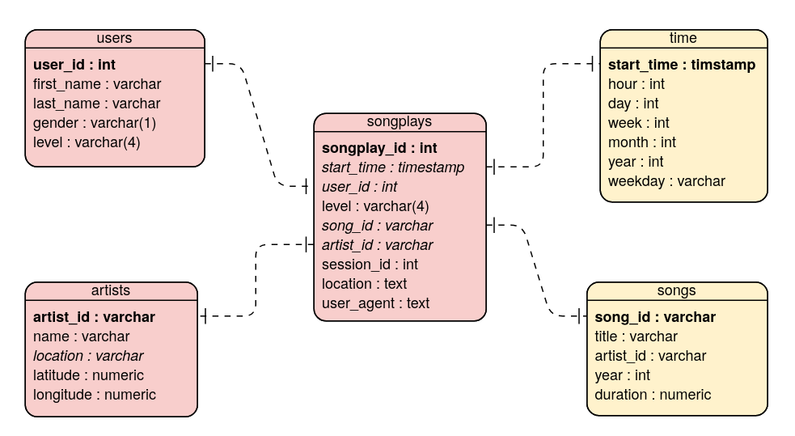
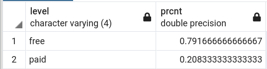

<h1>Data Engineering Nanodegree Program</h1>
<h3>Project 1: Data Modeling with Postgres</h3>

1. **The purpose of the database in the context of srartup, Sparkify, and their analytical goals.**
        * The database was created for the analysis of the Sparkify music streaming data logs on songs and user activity.
        * Since the analytics team is interested in the users' music choises, this database helps to perform such analysis. This relational database is a perfect solution for ease of quering the data as apposed to getting the data from the files stored in JSON logs.

***

2. **State and justify your db schema desing and ETL pileline**
        * The following image is our star schema

        * An implemented star schema, consists of four dimension tables (users, songs, artists, time) and a fact table playsongs). 
        * Each of the dimension tables has a primary key (i.e., users: user_id, songs: song_id, artists: artist_id, and time: start_time). These dimension tables are referenced by the songplays table with the corresponding foreign keys. 
        * Each of the dimension table allows for a simple answer of the Sparkify's needs regarding the users and songs (and if needed artists and time details).
        * `users` table, in addition, allows to update the status (`level`) of their account. A new 'upsert' query would do an update on the level if it encounters an already existing `user_id`.
        * Such desing is perfect for the business problem. The denormalized tables allow for easy quering and fast aggregation of all needed information as well as it helps to perform easy joins. 

***

3. **[Optional] Provide example queries and results for song play analysis.**
        * For example, Sporkify wants to know the proportion of users that pay for their service as apposed to those with free accounts. This could be done by a simple query to the `users` table:
`SELECT level, 
        count(*) / (SELECT count(*) FROM users)::float AS prcnt
 FROM users
 GROUP BY 1`
 

 
___

:bell: **Additional questions for the reviewer**
1) You said I could create an ER diagram. But I did include one into this readme file. Under #2. Is it not good enough because it doesn't have information on what the primary keys are (bold font) and other additional information? 
2) You wrote "I would suggest using proper headings, emphasis, underline the relevant keywords. Use bullet points, add link URLs and images to make the README better." 
I have used the links to the images here, and the headers, and the bullet points. I guess I don't understand how this file is supposed to look like to pass your format qualifications. Is it possible to look at some example of a readme file which you think is perfect? 

4) I have a question regarding the code in template files. Are we supposed to change it completely so it's not considered a plagiarism? Or it is not expected for this project?
5) What kinds of data checks are you asking for in this projects as an extra to make this project to stand out?
6) What kind of dashboard are you taking about? Do you simply want an extra ipynb file with visualizations or do you actually want us to integrate some kind of BI tool (like Tableau) into this project?
7) When you talk about the bulk insert of data, do you mean the direct insert json file -> postgres table thing?
I would really appreciate if you comment on this questions!
